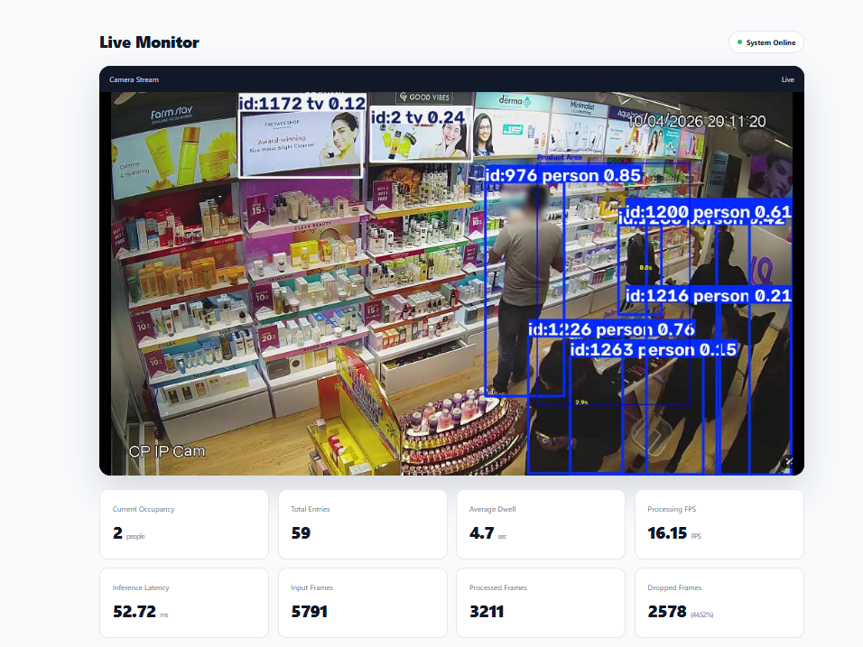

# D5 Real-Time Computer Vision Service

A production-oriented real-time computer vision service built with **Python, YOLO, ByteTrack, OpenCV, FastAPI, and Docker**.

The system processes video streams, performs object detection and tracking, and provides real-time analytics such as **zone occupancy, entry/exit events, dwell time, FPS, inference latency, and frame-drop statistics**.

## Features

- Real-time video processing with OpenCV
- YOLO object detection
- ByteTrack multi-object tracking
- Zone occupancy detection
- Entry/exit tracking
- Dwell-time calculation
- Bounded frame buffer with frame dropping
- FPS and inference-latency monitoring
- FastAPI REST API
- WebSocket live metrics
- MJPEG video streaming
- Health and readiness endpoints
- Docker support
- Unit tests with pytest
- PyTorch, ONNX Runtime, and OpenVINO benchmarking

## Architecture

```text
Video Source
     │
     ▼
VideoReader
     │
     ▼
FrameProducer
     │
     ▼
FrameBuffer
     │
     ▼
YOLO + ByteTrack
     │
     ├── Zone Occupancy
     ├── Entry / Exit
     ├── Dwell Time
     └── Performance Metrics
              │
              ▼
          CVService
              │
       ┌──────┼──────┐
       ▼      ▼      ▼
    /metrics  /ws   /video
                     │
                     ▼
                 Dashboard
```

## Project Structure

```text
realtime-cv-service/
│
├── app/
│   ├── config.py
│   ├── logging_config.py
│   ├── main.py
│   │
│   ├── analytics/
│   │   ├── dwell_time.py
│   │   ├── metrics.py
│   │   ├── occupancy.py
│   │   └── zone.py
│   │
│   ├── api/
│   │   ├── routes.py
│   │   └── server.py
│   │
│   ├── detection/
│   │   ├── detector.py
│   │   └── factory.py
│   │
│   ├── services/
│   │   └── cv_service.py
│   │
│   └── stream/
│       ├── frame_buffer.py
│       ├── pipeline.py
│       └── video_reader.py
│
├── dashboard/
│   └── index.html
│
├── benchmarks/
│   ├── benchmark_onnx.py
│   ├── benchmark_onnx_direct.py
│   ├── benchmark_openvino.py
│   ├── benchmark_pipeline.py
│   ├── benchmark_pytorch.py
│   ├── check_video.py
│   └── compare_detection_tracking.py
│
├── tests/
│   ├── test_dwell_time.py
│   ├── test_frame_buffer.py
│   ├── test_metrics.py
│   └── test_zone.py
│
├── Dockerfile
├── requirements.txt
└── README.md
```

## Tech Stack

- Python
- OpenCV
- YOLO
- ByteTrack
- FastAPI
- WebSocket
- PyTorch
- ONNX Runtime
- OpenVINO
- Docker
- pytest

## API

| Endpoint | Description |
| --- | --- |
| `GET /health` | Service health check |
| `GET /ready` | Service readiness check |
| `GET /metrics` | Current analytics and performance metrics |
| `GET /video` | Annotated MJPEG video stream |
| `WS /ws` | Real-time metrics |

## Configuration

Create a `.env` file:

```env
VIDEO_SOURCE=data/videos/CAM1.mp4
MODEL_PATH=yolo11n.pt
INFERENCE_BACKEND=pytorch
BUFFER_SIZE=2

ZONE_NAME=Product Area
ZONE_X1=1200
ZONE_Y1=200
ZONE_X2=1630
ZONE_Y2=880
```

## Run Locally

**1. Clone the repository**

```bash
git clone https://github.com/ankita0090119/realtime-cv-service.git
cd realtime-cv-service
```

**2. Create a virtual environment**

```bash
python -m venv venv
```

Activate it:

```bash
# Windows
venv\Scripts\activate

# macOS / Linux
source venv/bin/activate
```

**3. Install dependencies**

```bash
pip install -r requirements.txt
```

**4. Start the service**

```bash
python -m uvicorn app.api.server:app --host 127.0.0.1 --port 8000
```

Open the dashboard at <http://127.0.0.1:8000/dashboard/>.

## Screenshot



## Docker

**Build**

```bash
docker build -t realtime-cv-service .
```

**Run**

```bash
docker run --rm -p 8000:8000 -v "${PWD}\data:/app/data:ro" realtime-cv-service
```

## Testing

Run the test suite:

```bash
python -m pytest
```

The tests cover:

- Zone logic
- Frame buffering
- Dwell-time tracking
- Performance metrics

## Benchmarking

Benchmark scripts are available in the `benchmarks/` directory. They include:

- PyTorch inference
- ONNX Runtime inference
- OpenVINO inference
- Detection vs. tracking
- End-to-end pipeline performance

## License

This project is licensed under the MIT License. See the [LICENSE](LICENSE) file for details.
